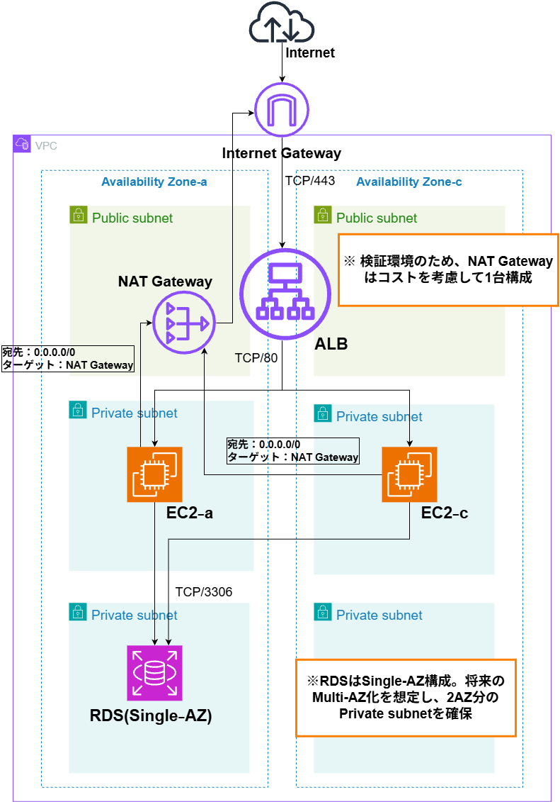

# AWS Webインフラストラクチャポートフォリオ

ALB・EC2・RDSを使った3層Webアーキテクチャを構築しました。

## 構成図



## 30秒サマリ

- AWS上で、セキュリティとコストを考慮したWebシステム構成を設計・構築することを課題とした。
- ALB、EC2×2、RDS、NAT Gatewayを構築した。
- 2AZ構成とし、ALBをPublic Subnet、EC2とRDSをPrivate Subnetに配置した。
- ALB経由でのWeb表示、2台のEC2からRDSへの接続、Private Subnet内のEC2から外向き通信ができることを確認した。

## 検証結果

### Webサーバの動作確認

`systemctl status nginx` を実行し、2台のEC2で `active (running)` を確認した。

### EC2 → RDS の接続確認

```bash
mysql -h <RDS_ENDPOINT> -u <DB_USER> -p
```

出力（抜粋）

```text
Welcome to the MySQL monitor.
```

2台のEC2からRDSへ接続できることを確認した。

### EC2 → Internet の通信確認

`curl https://checkip.amazonaws.com` を実行し、2台のPrivate EC2から外向きIPアドレスが返ることを確認した。これにより、NAT Gateway経由でインターネットへ通信できることを確認した。

### ALBの冗長化確認

EC2を1台停止し、停止側が `Unused`、稼働中のEC2が `Healthy` になることを確認した。

ALB経由で稼働中EC2のWebページが表示され、1台停止時でもサービスを継続できることを確認した。

## 判断の記録

[Decision Logを見る](docs/design-log.md)

## 詰まった1つ

- **症状**：EC2を1台停止後も、ブラウザでは停止側のページが表示された。
- **立てた仮説**：ALBの切り替え不良、稼働中EC2の応答不良、ブラウザキャッシュ。
- **確かめたこと**：
  - Target Groupで、稼働中EC2が `Healthy`、停止側が `Unused` になっていることを確認した。
  - EC2にSSH接続し、`curl localhost` を実行。nginxが正しいページを返すことを確認した。
  - PCのPowerShellで `curl http://<ALB_DNS_NAME>` を実行。ALB経由で稼働中EC2のページが返ることを確認した。
- **直した箇所**：設定変更は行わず、シークレットモードで再確認した。正常表示されたため、ブラウザキャッシュの影響と判断した。

## 作り直すなら

- RDS：Single-AZ → Multi-AZ化して可用性を高める。
- NAT Gateway：1台 → 各AZに配置して単一障害点を減らす。
- 通信：HTTP → ACMを利用してHTTPS化する。
- 構築方法：手動 → TerraformでIaC化し、再現性を高める。